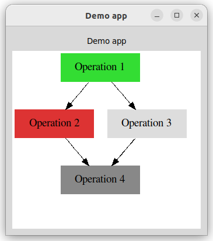

# Demo for an interactive graph application



## Requirements

This project uses Python3.11 features.

You need to have [Graphviz](https://graphviz.org/) installed on your machine.

```
sudo apt install graphviz graphviz-dev
```

## Tech stack

-   Python
    -   [Starlette](https://www.starlette.io/)
    -   [Jinja2](https://jinja.palletsprojects.com/en/latest/)
    -   [NetworkX](https://networkx.org/)
-   HTML / JS / CSS
    -   [HTMX](https://htmx.org/)
-   Visualization
    -   [Graphviz](https://graphviz.org/)

## Quick start

Install the application

```sh
pip install -e .
```

To also install development dependencies use:

```sh
pip install -e .[dev]
```

Launch the server and go to [http://0.0.0.0:5000](http://0.0.0.0:5000)

```sh
python -m interactive_graph
```
